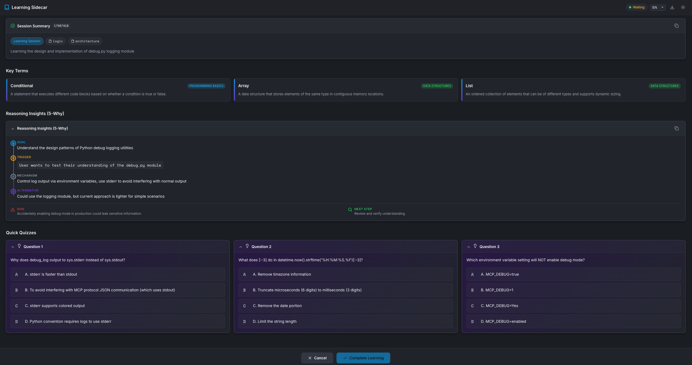

#  MCP Creator Growth

[English](README.md) | [简体中文](README_zh-CN.md) | [繁體中文](README_zh-TW.md)

A context-aware **Model Context Protocol (MCP)** server that acts as a learning sidecar for AI coding assistants. It helps developers **learn from AI-generated code changes** through interactive quizzes and provides agents with a persistent **project-specific debugging memory**.

[](https://opensource.org/licenses/MIT)
[](https://www.python.org/downloads/)
[](https://modelcontextprotocol.io/)
[](https://github.com/SunflowersLwtech/mcp_creator_growth/blob/main/DOCKER.md)
[](https://glama.ai/mcp/servers/@SunflowersLwtech/mcp_creator_growth)
[](https://deepwiki.com/SunflowersLwtech/mcp_creator_growth)

---

## 🌐 Resources

| Resource | Description |
|----------|-------------|
| [**Glama MCP Marketplace**](https://glama.ai/mcp/servers/@SunflowersLwtech/mcp_creator_growth) | Official MCP server listing with installation guides |
| [**DeepWiki Documentation**](https://deepwiki.com/SunflowersLwtech/mcp_creator_growth) | AI-generated deep analysis of the codebase |
| [**GitHub Repository**](https://github.com/SunflowersLwtech/mcp_creator_growth) | Source code, issues, and contributions |

---

## 🚀 Why Use This?

| For | Benefit |
|-----|---------|
| **Developers** | Don't just accept AI code—understand it. Request a quiz to verify your grasp of the logic, security, or performance implications. |
| **AI Agents** | Stop solving the same bug twice. The server quietly records debugging solutions and retrieves them automatically when similar errors occur. |

---

## 📦 Available Tools

| Tool | Type | Description |
|------|------|-------------|
| `learning_session` | 🎓 Interactive | Opens a WebUI quiz based on recent code changes. **Blocks** until user completes learning. |
| `debug_search` | 🔍 Silent RAG | Searches project debug history for relevant past solutions. Auto-triggered on errors. |
| `debug_record` | 📝 Silent | Records debugging experiences to project knowledge base. Auto-triggered after fixes. |
| `term_get` | 📚 Reference | Fetches programming terms/concepts. Tracks shown terms to avoid repetition. |

### Tool Details

<details>
<summary><b>🎓 learning_session</b> - Interactive Learning Card</summary>

**Trigger**: User explicitly requests (e.g., "Quiz me", "Test my understanding")

**Parameters**:
| Parameter | Type | Default | Description |
|-----------|------|---------|-------------|
| `project_directory` | string | `"."` | Project directory path |
| `summary` | string | — | Structured summary of Agent's actions |
| `reasoning` | object | null | 5-Why reasoning (goal, trigger, mechanism, alternatives, risks) |
| `quizzes` | array | auto-generated | 3 quiz questions with options, answer, explanation |
| `focus_areas` | array | `["logic"]` | Focus areas: logic, security, performance, architecture, syntax |
| `timeout` | int | 600 | Timeout in seconds (60-7200) |

**Returns**: `{"status": "completed", "action": "HALT_GENERATION"}`

</details>

<details>
<summary><b>🔍 debug_search</b> - Search Debug History</summary>

**Trigger**: Auto-called when encountering errors (silent, no UI)

**Parameters**:
| Parameter | Type | Default | Description |
|-----------|------|---------|-------------|
| `query` | string | — | Error message or description to search |
| `project_directory` | string | `"."` | Project directory path |
| `error_type` | string | null | Filter by error type (e.g., ImportError) |
| `tags` | array | null | Filter by tags |
| `limit` | int | 5 | Maximum results (1-20) |

**Returns**: `{"results": [...], "count": N}`

</details>

<details>
<summary><b>📝 debug_record</b> - Record Debug Experience</summary>

**Trigger**: Auto-called after fixing bugs (silent, background)

**Parameters**:
| Parameter | Type | Default | Description |
|-----------|------|---------|-------------|
| `context` | object | — | Error context: `{error_type, error_message, file, line}` |
| `cause` | string | — | Root cause analysis |
| `solution` | string | — | Solution that worked |
| `project_directory` | string | `"."` | Project directory path |
| `tags` | array | null | Tags for categorization |

**Returns**: `{"ok": true, "id": "..."}`

</details>

<details>
<summary><b>📚 term_get</b> - Get Programming Terms</summary>

**Available Domains**: programming_basics, data_structures, algorithms, software_design, web_development, version_control, testing, security, databases, devops

**Parameters**:
| Parameter | Type | Default | Description |
|-----------|------|---------|-------------|
| `project_directory` | string | `"."` | Project directory path |
| `count` | int | 3 | Number of terms (1-5) |
| `domain` | string | null | Filter by domain |

**Returns**: `{"terms": [...], "count": N, "remaining": N}`

</details>

---

## 🛠️ Installation

### One-Line Install (Recommended)

<table>
<tr>
<th>Platform</th>
<th>Command</th>
</tr>
<tr>
<td><b>macOS / Linux</b></td>
<td>

```bash
curl -fsSL https://raw.githubusercontent.com/SunflowersLwtech/mcp_creator_growth/main/scripts/install.sh | bash
```

</td>
</tr>
<tr>
<td><b>Windows (PowerShell)</b></td>
<td>

```powershell
irm https://raw.githubusercontent.com/SunflowersLwtech/mcp_creator_growth/main/scripts/install.ps1 | iex
```

</td>
</tr>
</table>

The installer will:
1. Auto-detect your Python environment (uv → conda → venv)
2. Clone the repository to `~/mcp-creator-growth`
3. Create virtual environment and install dependencies
4. Print the exact command to configure your IDE

### Manual Installation

<details>
<summary>Click to expand manual installation steps</summary>

**Prerequisites**: Python 3.11+ or [uv](https://docs.astral.sh/uv/)

```bash
# 1. Clone the repository
git clone https://github.com/SunflowersLwtech/mcp_creator_growth.git
cd mcp_creator_growth

# 2. Create virtual environment and install
# Using uv (recommended)
uv venv --python 3.11 mcp-creator-growth
source mcp-creator-growth/bin/activate          # macOS/Linux
# mcp-creator-growth\Scripts\activate           # Windows
uv pip install -e '.[dev]'

# Or using standard venv
python -m venv mcp-creator-growth
source mcp-creator-growth/bin/activate           # macOS/Linux
# mcp-creator-growth\Scripts\activate            # Windows
pip install -e '.[dev]'
```

</details>

### Docker Installation

<details>
<summary>Click to expand Docker installation steps</summary>

**Prerequisites**: Docker installed on your system

```bash
# 1. Pull from Docker Hub (when available)
docker pull sunflowerslwtech/mcp-creator-growth:latest

# Or build locally
git clone https://github.com/SunflowersLwtech/mcp_creator_growth.git
cd mcp_creator_growth
docker build -t mcp-creator-growth .

# 2. Run with Docker
docker run -i mcp-creator-growth

# 3. Or use Docker Compose
docker-compose up -d
```

For detailed Docker usage, persistent storage, and Claude Desktop integration, see **[DOCKER.md](DOCKER.md)**.

</details>

---

## ⚙️ IDE Configuration

### Claude Code (CLI) — One Command Setup

After installation, configure your AI coding IDE to use this MCP server.

### Claude Code

**Option 1: CLI (Recommended)**
```bash
# macOS / Linux
claude mcp add mcp-creator-growth -- ~/mcp-creator-growth/mcp-creator-growth/bin/mcp-creator-growth

# Windows
claude mcp add mcp-creator-growth -- %USERPROFILE%\mcp-creator-growth\mcp-creator-growth\Scripts\mcp-creator-growth.exe
```

**Option 2: Config File**

Add to `~/.claude.json`:
```json
{
  "mcpServers": {
    "mcp-creator-growth": {
      "command": "~/mcp-creator-growth/mcp-creator-growth/bin/mcp-creator-growth"
    }
  }
}
```

For Windows:
```json
{
  "mcpServers": {
    "mcp-creator-growth": {
      "command": "C:\\Users\\YourName\\mcp-creator-growth\\mcp-creator-growth\\Scripts\\mcp-creator-growth.exe"
    }
  }
}
```

Example paths:
- Unix (uv): `~/mcp-creator-growth/mcp-creator-growth/bin/mcp-creator-growth`
- Windows (uv): `C:\\Users\\YourName\\mcp-creator-growth\\mcp-creator-growth\\Scripts\\mcp-creator-growth.exe`
- Windows (conda): `C:\\Users\\YourName\\anaconda3\\envs\\mcp-creator-growth\\Scripts\\mcp-creator-growth.exe`

### Cursor

Add to Cursor MCP settings (Settings → MCP → Add Server):

```json
{
  "mcp-creator-growth": {
    "command": "~/mcp-creator-growth/mcp-creator-growth/bin/mcp-creator-growth"
  }
}
```

For Windows:
```json
{
  "mcp-creator-growth": {
    "command": "C:\\Users\\YourName\\mcp-creator-growth\\mcp-creator-growth\\Scripts\\mcp-creator-growth.exe"
  }
}
```

### Windsurf

Add to `~/.codeium/windsurf/mcp_config.json`:

```json
{
  "mcpServers": {
    "mcp-creator-growth": {
      "command": "~/mcp-creator-growth/mcp-creator-growth/bin/mcp-creator-growth"
    }
  }
}
```

### Docker Configuration

To use Docker with any MCP-compatible IDE:

```json
{
  "mcpServers": {
    "mcp-creator-growth": {
      "command": "docker",
      "args": [
        "run",
        "-i",
        "--rm",
        "-v",
        "/path/to/your/project:/workspace",
        "-w",
        "/workspace",
        "mcp-creator-growth"
      ]
    }
  }
}
```

See **[DOCKER.md](DOCKER.md)** for detailed Docker configuration examples for Claude Desktop, Cursor, and other IDEs.

### Other IDEs

For any MCP-compatible IDE, use these settings:
- **Command:** `<install-path>/mcp-creator-growth/bin/mcp-creator-growth` (or `mcp-creator-growth\Scripts\mcp-creator-growth.exe` on Windows)
- **Transport:** stdio

**After configuration, restart your IDE.**

## Usage

### Available Tools

| Tool | Trigger | For | Returns |
|------|---------|-----|---------|
| `learning_session` | User explicit request | **User** | `{status, action}` - minimal |
| `debug_search` | Automatic (on error) | **Agent** | Compact summaries |
| `debug_record` | Automatic (after fix) | **Agent** | `{ok, id}` - minimal |

### For Users: Learning Session

Say to your AI assistant:
- "Quiz me on this change"
- "Test my understanding"
- "Help me learn about what you did"

The agent will create an interactive learning card and **wait** until you complete it.

> **Note**: Quiz scores are saved locally for your self-tracking but are NOT returned to the agent - this keeps the context clean.

### For Agents: Debug Tools

The debug tools work silently in the background:
- **Search first**: When encountering errors, agent searches past solutions
- **Record after**: When fixing errors, agent records the solution
- **Progressive disclosure**: Returns compact summaries, not full records
- **Fast lookups**: Uses inverted index for keyword-based searches

## Updating

### One-Line Update (Recommended)

The remote update script automatically detects your installation and works with **any path format** (including Chinese/non-ASCII paths):

<table>
<tr>
<td><b>macOS / Linux</b></td>
<td>

```bash
curl -fsSL https://raw.githubusercontent.com/SunflowersLwtech/mcp_creator_growth/main/scripts/update.sh | bash
```

</td>
</tr>
<tr>
<td><b>Windows (PowerShell)</b></td>
<td>

```powershell
irm https://raw.githubusercontent.com/SunflowersLwtech/mcp_creator_growth/main/scripts/update.ps1 | iex
```

</td>
</tr>
</table>

The update script will:
1. **Auto-detect** your installation location (supports multiple installations)
2. **Pull** the latest changes from the repository
3. **Force-reinstall** dependencies to ensure version synchronization
4. **Verify** installation integrity and report any issues
5. Detect if MCP server is in use and provide clear instructions

> **Why remote update?**
> - ✅ Works with Chinese/non-ASCII paths without `cd` navigation
> - ✅ Always uses the latest update logic from the repository
> - ✅ Auto-detects installation location even if you forgot where it is
> - ✅ Handles multiple installations gracefully

### Local Update (Alternative)

**macOS / Linux:**
```bash
~/mcp-creator-growth/scripts/update.sh
```

**Windows (PowerShell):**
```powershell
~\mcp-creator-growth\scripts\update.ps1
```

### Manual Update

<details>
<summary>Click to expand manual update steps</summary>

```bash
# Navigate to installation directory
cd ~/mcp-creator-growth  # or your custom installation path

# Pull latest changes
git pull origin main

# Update dependencies
# Using uv
source mcp-creator-growth/bin/activate          # macOS/Linux
# mcp-creator-growth\Scripts\activate           # Windows
uv pip install -e '.[dev]' --upgrade

# Or using standard venv
source mcp-creator-growth/bin/activate           # macOS/Linux
# mcp-creator-growth\Scripts\activate            # Windows
pip install -e '.[dev]' --upgrade
```

</details>

---

## 🖼️ Screenshots

### Learning Session WebUI



---

## 🔒 Security & Privacy

| Aspect | Details |
|--------|---------|
| **Local First** | All data stored in `.mcp-sidecar/` directory within your project |
| **No Telemetry** | Zero data sent to external servers |
| **Full Control** | Delete `.mcp-sidecar/` anytime to reset all data |

---

## 🔮 Roadmap

We're building toward a **Personalized Learning Center** that grows with you. Here's what's coming:

### 🔍 Advanced Search & Indexing (v1.2)

| Feature | Description |
|---------|-------------|
| **SQLite FTS5** | Full-text search with Chinese support, prefix matching, and boolean queries |
| **BM25 Ranking** | Industry-standard relevance scoring for better search results |
| **Semantic Search** | Vector embeddings for meaning-based matching (e.g., "权限错误" finds "permission denied") |
| **Cross-project Search** | Search debug experiences across all your projects |

### 📱 Mobile App (v2.0)

| Feature | Description |
|---------|-------------|
| **Learning History Sync** | Access your quiz history and learning progress on mobile |
| **Spaced Repetition** | Smart review scheduling based on forgetting curves |
| **Offline Mode** | Learn anywhere, sync when connected |
| **Push Notifications** | Gentle reminders to review concepts you're forgetting |

### 🎯 Personalized Learning Center (v2.5)

| Feature | Description |
|---------|-------------|
| **Knowledge Graph** | Visual map of concepts you've learned and their connections |
| **Weakness Analysis** | AI identifies areas where you struggle and suggests focused practice |
| **Learning Streaks** | Gamification to keep you motivated |
| **Team Insights** | (Optional) Share anonymized learning patterns with your team |

### 🤖 AI Enhancements (v3.0)

| Feature | Description |
|---------|-------------|
| **Adaptive Quizzes** | Questions adjust difficulty based on your performance |
| **Code Pattern Recognition** | Learn from patterns in your own codebase |
| **Multi-language Support** | Explanations in your preferred language |
| **Voice Interface** | "Hey Claude, quiz me on what we did yesterday" |

> **Want to influence the roadmap?** [Open an issue](https://github.com/SunflowersLwtech/mcp_creator_growth/issues) or join the discussion!

---

## 🔧 Environment Variables

| Variable | Default | Description |
|----------|---------|-------------|
| `MCP_DEBUG` | `false` | Enable debug logging (`true`, `1`, `yes`, `on`) |
| `MCP_TIMEOUT` | `120000` | MCP server startup timeout in ms |
| `MAX_MCP_OUTPUT_TOKENS` | `25000` | Maximum tokens for MCP output |

---

## 🤝 Contributing

We welcome contributions! Please follow these steps:

1. Fork the repository
2. Create a feature branch: `git checkout -b feature/amazing-feature`
3. Install dev dependencies: `uv pip install -e '.[dev]'`
4. Make changes and run tests: `pytest`
5. Submit a Pull Request

See [CONTRIBUTING.md](CONTRIBUTING.md) for detailed guidelines.

---

## 📬 Contact

| Channel | Address |
|---------|---------|
| **Email** | sunflowers0607@outlook.com |
| **Email** | weiliu0607@gmail.com |
| **GitHub Issues** | [Open an Issue](https://github.com/SunflowersLwtech/mcp_creator_growth/issues) |

---

## 📄 License

This project is licensed under the [MIT License](LICENSE).

---

<p align="center">
  Built with <a href="https://github.com/jlowin/fastmcp">FastMCP</a> •
  <a href="https://modelcontextprotocol.io">MCP Standard</a> •
  <a href="https://glama.ai/mcp/servers/@SunflowersLwtech/mcp_creator_growth">Glama MCP</a>
</p>
