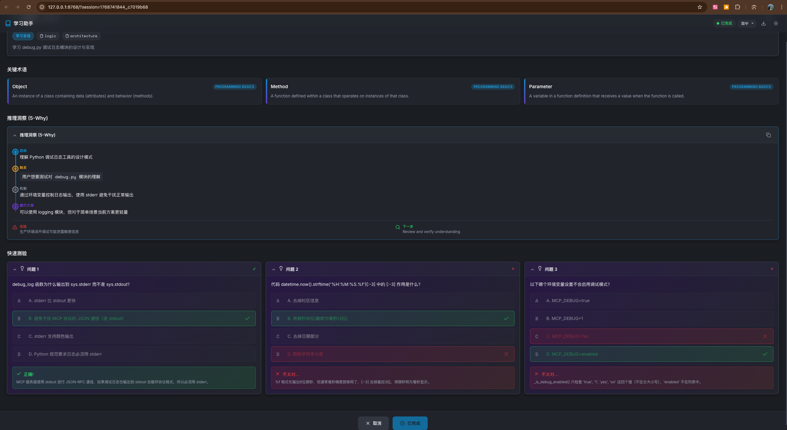

#  MCP Creator Growth

[English](README.md) | [简体中文](README_zh-CN.md) | [繁體中文](README_zh-TW.md)

一个具备上下文感知能力的 **Model Context Protocol (MCP)** 服务器，作为 AI 编程助手的「学习侧边栏」。它通过互动测验帮助开发者**从 AI 生成的代码变更中学习**，并为智能体提供持久化的**项目级调试记忆**。

[](https://opensource.org/licenses/MIT)
[](https://www.python.org/downloads/)
[](https://modelcontextprotocol.io/)
[](https://glama.ai/mcp/servers/@SunflowersLwtech/mcp_creator_growth)
[](https://deepwiki.com/SunflowersLwtech/mcp_creator_growth)

---

## 🌐 资源链接

| 资源 | 描述 |
|------|------|
| [**Glama MCP 市场**](https://glama.ai/mcp/servers/@SunflowersLwtech/mcp_creator_growth) | 官方 MCP 服务器列表，含安装指南 |
| [**DeepWiki 文档**](https://deepwiki.com/SunflowersLwtech/mcp_creator_growth) | AI 生成的代码库深度解析 |
| [**GitHub 仓库**](https://github.com/SunflowersLwtech/mcp_creator_growth) | 源代码、Issue 和贡献 |

---

## 🚀 为什么使用它？

| 角色 | 收益 |
|------|------|
| **开发者** | 不要只接受 AI 的代码——要理解它。请求测验来验证你对逻辑、安全性或性能影响的理解。 |
| **AI 智能体** | 不再重复解决同一个 Bug。服务器会静默记录调试方案，并在遇到类似错误时自动检索。 |

---

## 📦 可用工具

| 工具 | 类型 | 描述 |
|------|------|------|
| `learning_session` | 🎓 互动式 | 打开 WebUI 测验界面，基于最近的代码变更生成题目。**阻塞**直到用户完成学习。 |
| `debug_search` | 🔍 静默 RAG | 搜索项目调试历史，查找相关的历史解决方案。遇到错误时自动触发。 |
| `debug_record` | 📝 静默 | 将调试经验记录到项目知识库。修复 Bug 后自动触发。 |
| `term_get` | 📚 参考 | 获取编程术语和概念。跟踪已展示的术语以避免重复。 |
| `get_system_info` | ℹ️ 工具 | 返回系统环境信息（平台、Python 版本等）。 |

### 工具详情

<details>
<summary><b>🎓 learning_session</b> - 互动学习卡片</summary>

**触发条件**: 用户显式请求（例如：「考考我」、「测试我的理解」）

**参数**:
| 参数 | 类型 | 默认值 | 描述 |
|------|------|--------|------|
| `project_directory` | string | `"."` | 项目目录路径 |
| `summary` | string | — | Agent 操作的结构化摘要 |
| `reasoning` | object | null | 5-Why 推理（目标、触发、机制、替代方案、风险） |
| `quizzes` | array | 自动生成 | 3 道测验题，包含选项、答案、解释 |
| `focus_areas` | array | `["logic"]` | 重点领域：logic、security、performance、architecture、syntax |
| `timeout` | int | 600 | 超时时间（秒，60-7200） |

**返回**: `{"status": "completed", "action": "HALT_GENERATION"}`

</details>

<details>
<summary><b>🔍 debug_search</b> - 搜索调试历史</summary>

**触发条件**: 遇到错误时自动调用（静默，无 UI）

**参数**:
| 参数 | 类型 | 默认值 | 描述 |
|------|------|--------|------|
| `query` | string | — | 要搜索的错误消息或描述 |
| `project_directory` | string | `"."` | 项目目录路径 |
| `error_type` | string | null | 按错误类型过滤（如 ImportError） |
| `tags` | array | null | 按标签过滤 |
| `limit` | int | 5 | 最大结果数（1-20） |

**返回**: `{"results": [...], "count": N}`

</details>

<details>
<summary><b>📝 debug_record</b> - 记录调试经验</summary>

**触发条件**: 修复 Bug 后自动调用（静默，后台运行）

**参数**:
| 参数 | 类型 | 默认值 | 描述 |
|------|------|--------|------|
| `context` | object | — | 错误上下文：`{error_type, error_message, file, line}` |
| `cause` | string | — | 根因分析 |
| `solution` | string | — | 有效的解决方案 |
| `project_directory` | string | `"."` | 项目目录路径 |
| `tags` | array | null | 分类标签 |

**返回**: `{"ok": true, "id": "..."}`

</details>

<details>
<summary><b>📚 term_get</b> - 获取编程术语</summary>

**可用领域**: programming_basics、data_structures、algorithms、software_design、web_development、version_control、testing、security、databases、devops

**参数**:
| 参数 | 类型 | 默认值 | 描述 |
|------|------|--------|------|
| `project_directory` | string | `"."` | 项目目录路径 |
| `count` | int | 3 | 术语数量（1-5） |
| `domain` | string | null | 按领域过滤 |

**返回**: `{"terms": [...], "count": N, "remaining": N}`

</details>

---

## 🛠️ 安装

### 一键安装（推荐）

<table>
<tr>
<th>平台</th>
<th>命令</th>
</tr>
<tr>
<td><b>macOS / Linux</b></td>
<td>

```bash
curl -fsSL https://raw.githubusercontent.com/SunflowersLwtech/mcp_creator_growth/main/scripts/install.sh | bash
```

</td>
</tr>
<tr>
<td><b>Windows (PowerShell)</b></td>
<td>

```powershell
irm https://raw.githubusercontent.com/SunflowersLwtech/mcp_creator_growth/main/scripts/install.ps1 | iex
```

</td>
</tr>
</table>

安装脚本会：
1. 自动检测 Python 环境（uv → conda → venv）
2. 克隆仓库到 `~/mcp-creator-growth`
3. 创建虚拟环境并安装依赖
4. 输出配置 IDE 所需的确切命令

### 手动安装

<details>
<summary>点击展开手动安装步骤</summary>

**前置条件**: Python 3.11+ 或 [uv](https://docs.astral.sh/uv/)

```bash
# 1. 克隆仓库
git clone https://github.com/SunflowersLwtech/mcp_creator_growth.git
cd mcp_creator_growth

# 2. 创建虚拟环境并安装
# 使用 uv（推荐）
uv venv --python 3.11 .venv
source .venv/bin/activate          # macOS/Linux
# .venv\Scripts\activate           # Windows
uv pip install -e ".[dev]"

# 或使用标准 venv
python -m venv venv
source venv/bin/activate           # macOS/Linux
# venv\Scripts\activate            # Windows
pip install -e ".[dev]"
```

</details>

---

## ⚙️ IDE 配置

### Claude Code (CLI) — 一条命令配置

安装完成后，使用一条命令配置 Claude Code：

<table>
<tr>
<th>平台</th>
<th>命令</th>
</tr>
<tr>
<td><b>macOS / Linux</b></td>
<td>

```bash
# 用户级（所有项目可用）
claude mcp add --scope user mcp-creator-growth -- ~/mcp-creator-growth/.venv/bin/mcp-creator-growth

# 或项目级（通过 .mcp.json 与团队共享）
claude mcp add --scope project mcp-creator-growth -- ~/mcp-creator-growth/.venv/bin/mcp-creator-growth
```

</td>
</tr>
<tr>
<td><b>Windows (PowerShell)</b></td>
<td>

```powershell
# 用户级
claude mcp add --scope user mcp-creator-growth -- "$env:USERPROFILE\mcp-creator-growth\.venv\Scripts\mcp-creator-growth.exe"

# 或项目级
claude mcp add --scope project mcp-creator-growth -- "$env:USERPROFILE\mcp-creator-growth\.venv\Scripts\mcp-creator-growth.exe"
```

</td>
</tr>
</table>

**验证安装：**
```bash
claude mcp list                    # 列出所有 MCP 服务器
claude mcp get mcp-creator-growth  # 检查此服务器状态
```

### 手动 JSON 配置

适用于 Claude Desktop、Cursor、Windsurf 或其他 MCP 兼容 IDE：

<table>
<tr>
<th>IDE</th>
<th>配置文件位置</th>
</tr>
<tr>
<td>Claude Desktop</td>
<td>

- macOS: `~/Library/Application Support/Claude/claude_desktop_config.json`
- Windows: `%APPDATA%\Claude\claude_desktop_config.json`
- Linux: `~/.config/Claude/claude_desktop_config.json`

</td>
</tr>
<tr>
<td>Claude Code（用户级）</td>
<td><code>~/.claude.json</code></td>
</tr>
<tr>
<td>Claude Code（项目级）</td>
<td>项目根目录下的 <code>.mcp.json</code></td>
</tr>
<tr>
<td>Cursor</td>
<td>Settings → MCP → Add New MCP Server</td>
</tr>
<tr>
<td>Windsurf</td>
<td><code>~/.codeium/windsurf/mcp_config.json</code></td>
</tr>
</table>

**JSON 配置：**

<details>
<summary><b>macOS / Linux</b></summary>

```json
{
  "mcpServers": {
    "mcp-creator-growth": {
      "command": "/Users/YOUR_USERNAME/mcp-creator-growth/.venv/bin/mcp-creator-growth",
      "args": []
    }
  }
}
```

</details>

<details>
<summary><b>Windows</b></summary>

```json
{
  "mcpServers": {
    "mcp-creator-growth": {
      "command": "C:\\Users\\YOUR_USERNAME\\mcp-creator-growth\\.venv\\Scripts\\mcp-creator-growth.exe",
      "args": []
    }
  }
}
```

</details>

> **注意**: 将 `YOUR_USERNAME` 替换为你的实际用户名，或使用安装脚本输出的完整路径。

---

## 🖼️ 截图

### 学习会话 WebUI



---

## 🔒 安全与隐私

| 方面 | 详情 |
|------|------|
| **本地优先** | 所有数据存储在项目内的 `.mcp-sidecar/` 目录 |
| **无遥测** | 不向外部服务器发送任何数据 |
| **完全掌控** | 随时删除 `.mcp-sidecar/` 即可重置所有数据 |

---

## 🔧 环境变量

| 变量 | 默认值 | 描述 |
|------|--------|------|
| `MCP_DEBUG` | `false` | 启用调试日志（`true`、`1`、`yes`、`on`） |
| `MCP_TIMEOUT` | `120000` | MCP 服务器启动超时时间（毫秒） |
| `MAX_MCP_OUTPUT_TOKENS` | `25000` | MCP 输出的最大 token 数 |

---

## 🤝 贡献

我们欢迎贡献！请遵循以下步骤：

1. Fork 本仓库
2. 创建特性分支：`git checkout -b feature/amazing-feature`
3. 安装开发依赖：`uv pip install -e ".[dev]"`
4. 进行更改并运行测试：`pytest`
5. 提交 Pull Request

详细指南请参阅 [CONTRIBUTING.md](CONTRIBUTING.md)。

---

## 📬 联系方式

| 渠道 | 地址 |
|------|------|
| **邮箱** | sunflowers0607@outlook.com |
| **邮箱** | weiliu0607@gmail.com |
| **GitHub Issues** | [提交 Issue](https://github.com/SunflowersLwtech/mcp_creator_growth/issues) |

---

## 📄 许可证

本项目基于 [MIT License](LICENSE) 授权。

---

<p align="center">
  基于 <a href="https://github.com/jlowin/fastmcp">FastMCP</a> 构建 •
  <a href="https://modelcontextprotocol.io">MCP 标准</a> •
  <a href="https://glama.ai/mcp/servers/@SunflowersLwtech/mcp_creator_growth">Glama MCP</a>
</p>
