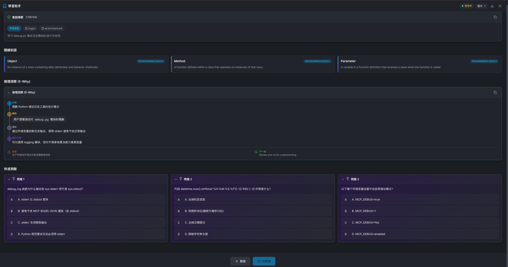

#  MCP Creator Growth

[English](README.md) | [简体中文](README_zh-CN.md) | [繁體中文](README_zh-TW.md)

一個具備上下文感知能力的 **Model Context Protocol (MCP)** 伺服器，作為 AI 編程助手的「學習側邊欄」。它通過互動測驗幫助開發者**從 AI 生成的程式碼變更中學習**，並為智能體提供持久化的**專案級除錯記憶**。

[](https://opensource.org/licenses/MIT)
[](https://www.python.org/downloads/)
[](https://modelcontextprotocol.io/)
[](https://glama.ai/mcp/servers/@SunflowersLwtech/mcp_creator_growth)
[](https://deepwiki.com/SunflowersLwtech/mcp_creator_growth)

---

## 🌐 資源連結

| 資源 | 描述 |
|------|------|
| [**Glama MCP 市場**](https://glama.ai/mcp/servers/@SunflowersLwtech/mcp_creator_growth) | 官方 MCP 伺服器列表，含安裝指南 |
| [**DeepWiki 文檔**](https://deepwiki.com/SunflowersLwtech/mcp_creator_growth) | AI 生成的程式碼庫深度解析 |
| [**GitHub 倉庫**](https://github.com/SunflowersLwtech/mcp_creator_growth) | 原始碼、Issue 和貢獻 |

---

## 🚀 為什麼使用它？

| 角色 | 收益 |
|------|------|
| **開發者** | 不要只接受 AI 的程式碼——要理解它。請求測驗來驗證你對邏輯、安全性或效能影響的理解。 |
| **AI 智能體** | 不再重複解決同一個 Bug。伺服器會靜默記錄除錯方案，並在遇到類似錯誤時自動檢索。 |

---

## 📦 可用工具

| 工具 | 類型 | 描述 |
|------|------|------|
| `learning_session` | 🎓 互動式 | 開啟 WebUI 測驗介面，基於最近的程式碼變更生成題目。**阻塞**直到使用者完成學習。 |
| `debug_search` | 🔍 靜默 RAG | 搜尋專案除錯歷史，查找相關的歷史解決方案。遇到錯誤時自動觸發。 |
| `debug_record` | 📝 靜默 | 將除錯經驗記錄到專案知識庫。修復 Bug 後自動觸發。 |
| `term_get` | 📚 參考 | 獲取程式設計術語和概念。追蹤已展示的術語以避免重複。 |
| `get_system_info` | ℹ️ 工具 | 回傳系統環境資訊（平台、Python 版本等）。 |

### 工具詳情

<details>
<summary><b>🎓 learning_session</b> - 互動學習卡片</summary>

**觸發條件**: 使用者顯式請求（例如：「考考我」、「測試我的理解」）

**參數**:
| 參數 | 類型 | 預設值 | 描述 |
|------|------|--------|------|
| `project_directory` | string | `"."` | 專案目錄路徑 |
| `summary` | string | — | Agent 操作的結構化摘要 |
| `reasoning` | object | null | 5-Why 推理（目標、觸發、機制、替代方案、風險） |
| `quizzes` | array | 自動生成 | 3 道測驗題，包含選項、答案、解釋 |
| `focus_areas` | array | `["logic"]` | 重點領域：logic、security、performance、architecture、syntax |
| `timeout` | int | 600 | 逾時時間（秒，60-7200） |

**回傳**: `{"status": "completed", "action": "HALT_GENERATION"}`

</details>

<details>
<summary><b>🔍 debug_search</b> - 搜尋除錯歷史</summary>

**觸發條件**: 遇到錯誤時自動呼叫（靜默，無 UI）

**參數**:
| 參數 | 類型 | 預設值 | 描述 |
|------|------|--------|------|
| `query` | string | — | 要搜尋的錯誤訊息或描述 |
| `project_directory` | string | `"."` | 專案目錄路徑 |
| `error_type` | string | null | 按錯誤類型過濾（如 ImportError） |
| `tags` | array | null | 按標籤過濾 |
| `limit` | int | 5 | 最大結果數（1-20） |

**回傳**: `{"results": [...], "count": N}`

</details>

<details>
<summary><b>📝 debug_record</b> - 記錄除錯經驗</summary>

**觸發條件**: 修復 Bug 後自動呼叫（靜默，背景執行）

**參數**:
| 參數 | 類型 | 預設值 | 描述 |
|------|------|--------|------|
| `context` | object | — | 錯誤上下文：`{error_type, error_message, file, line}` |
| `cause` | string | — | 根因分析 |
| `solution` | string | — | 有效的解決方案 |
| `project_directory` | string | `"."` | 專案目錄路徑 |
| `tags` | array | null | 分類標籤 |

**回傳**: `{"ok": true, "id": "..."}`

</details>

<details>
<summary><b>📚 term_get</b> - 獲取程式設計術語</summary>

**可用領域**: programming_basics、data_structures、algorithms、software_design、web_development、version_control、testing、security、databases、devops

**參數**:
| 參數 | 類型 | 預設值 | 描述 |
|------|------|--------|------|
| `project_directory` | string | `"."` | 專案目錄路徑 |
| `count` | int | 3 | 術語數量（1-5） |
| `domain` | string | null | 按領域過濾 |

**回傳**: `{"terms": [...], "count": N, "remaining": N}`

</details>

---

## 🛠️ 安裝

### 一鍵安裝（推薦）

<table>
<tr>
<th>平台</th>
<th>命令</th>
</tr>
<tr>
<td><b>macOS / Linux</b></td>
<td>

```bash
curl -fsSL https://raw.githubusercontent.com/SunflowersLwtech/mcp_creator_growth/main/scripts/install.sh | bash
```

</td>
</tr>
<tr>
<td><b>Windows (PowerShell)</b></td>
<td>

```powershell
irm https://raw.githubusercontent.com/SunflowersLwtech/mcp_creator_growth/main/scripts/install.ps1 | iex
```

</td>
</tr>
</table>

安裝腳本會：
1. 自動檢測 Python 環境（uv → conda → venv）
2. 克隆倉庫到 `~/mcp-creator-growth`
3. 建立虛擬環境並安裝依賴
4. 輸出配置 IDE 所需的確切命令

### 手動安裝

<details>
<summary>點擊展開手動安裝步驟</summary>

**前置條件**: Python 3.11+ 或 [uv](https://docs.astral.sh/uv/)

```bash
# 1. 克隆倉庫
git clone https://github.com/SunflowersLwtech/mcp_creator_growth.git
cd mcp_creator_growth

# 2. 建立虛擬環境並安裝
# 使用 uv（推薦）
uv venv --python 3.11 .venv
source .venv/bin/activate          # macOS/Linux
# .venv\Scripts\activate           # Windows
uv pip install -e ".[dev]"

# 或使用標準 venv
python -m venv venv
source venv/bin/activate           # macOS/Linux
# venv\Scripts\activate            # Windows
pip install -e ".[dev]"
```

</details>

---

## ⚙️ IDE 配置

### Claude Code (CLI) — 一條命令配置

安裝完成後，使用一條命令配置 Claude Code：

<table>
<tr>
<th>平台</th>
<th>命令</th>
</tr>
<tr>
<td><b>macOS / Linux</b></td>
<td>

```bash
# 使用者級（所有專案可用）
claude mcp add --scope user mcp-creator-growth -- ~/mcp-creator-growth/.venv/bin/mcp-creator-growth

# 或專案級（通過 .mcp.json 與團隊共享）
claude mcp add --scope project mcp-creator-growth -- ~/mcp-creator-growth/.venv/bin/mcp-creator-growth
```

</td>
</tr>
<tr>
<td><b>Windows (PowerShell)</b></td>
<td>

```powershell
# 使用者級
claude mcp add --scope user mcp-creator-growth -- "$env:USERPROFILE\mcp-creator-growth\.venv\Scripts\mcp-creator-growth.exe"

# 或專案級
claude mcp add --scope project mcp-creator-growth -- "$env:USERPROFILE\mcp-creator-growth\.venv\Scripts\mcp-creator-growth.exe"
```

</td>
</tr>
</table>

**驗證安裝：**
```bash
claude mcp list                    # 列出所有 MCP 伺服器
claude mcp get mcp-creator-growth  # 檢查此伺服器狀態
```

### 手動 JSON 配置

適用於 Claude Desktop、Cursor、Windsurf 或其他 MCP 相容 IDE：

<table>
<tr>
<th>IDE</th>
<th>配置檔案位置</th>
</tr>
<tr>
<td>Claude Desktop</td>
<td>

- macOS: `~/Library/Application Support/Claude/claude_desktop_config.json`
- Windows: `%APPDATA%\Claude\claude_desktop_config.json`
- Linux: `~/.config/Claude/claude_desktop_config.json`

</td>
</tr>
<tr>
<td>Claude Code（使用者級）</td>
<td><code>~/.claude.json</code></td>
</tr>
<tr>
<td>Claude Code（專案級）</td>
<td>專案根目錄下的 <code>.mcp.json</code></td>
</tr>
<tr>
<td>Cursor</td>
<td>Settings → MCP → Add New MCP Server</td>
</tr>
<tr>
<td>Windsurf</td>
<td><code>~/.codeium/windsurf/mcp_config.json</code></td>
</tr>
</table>

**JSON 配置：**

<details>
<summary><b>macOS / Linux</b></summary>

```json
{
  "mcpServers": {
    "mcp-creator-growth": {
      "command": "/Users/YOUR_USERNAME/mcp-creator-growth/.venv/bin/mcp-creator-growth",
      "args": []
    }
  }
}
```

</details>

<details>
<summary><b>Windows</b></summary>

```json
{
  "mcpServers": {
    "mcp-creator-growth": {
      "command": "C:\\Users\\YOUR_USERNAME\\mcp-creator-growth\\.venv\\Scripts\\mcp-creator-growth.exe",
      "args": []
    }
  }
}
```

</details>

> **注意**: 將 `YOUR_USERNAME` 替換為你的實際使用者名稱，或使用安裝腳本輸出的完整路徑。

---

## 🖼️ 截圖

### 學習會話 WebUI



---

## 🔒 安全與隱私

| 方面 | 詳情 |
|------|------|
| **本地優先** | 所有資料存儲在專案內的 `.mcp-sidecar/` 目錄 |
| **無遙測** | 不向外部伺服器發送任何資料 |
| **完全掌控** | 隨時刪除 `.mcp-sidecar/` 即可重置所有資料 |

---

## 🔧 環境變數

| 變數 | 預設值 | 描述 |
|------|--------|------|
| `MCP_DEBUG` | `false` | 啟用除錯日誌（`true`、`1`、`yes`、`on`） |
| `MCP_TIMEOUT` | `120000` | MCP 伺服器啟動逾時時間（毫秒） |
| `MAX_MCP_OUTPUT_TOKENS` | `25000` | MCP 輸出的最大 token 數 |

---

## 🤝 貢獻

我們歡迎貢獻！請遵循以下步驟：

1. Fork 本倉庫
2. 建立特性分支：`git checkout -b feature/amazing-feature`
3. 安裝開發依賴：`uv pip install -e ".[dev]"`
4. 進行更改並執行測試：`pytest`
5. 提交 Pull Request

詳細指南請參閱 [CONTRIBUTING.md](CONTRIBUTING.md)。

---

## 📬 聯繫方式

| 渠道 | 地址 |
|------|------|
| **郵箱** | sunflowers0607@outlook.com |
| **郵箱** | weiliu0607@gmail.com |
| **GitHub Issues** | [提交 Issue](https://github.com/SunflowersLwtech/mcp_creator_growth/issues) |

---

## 📄 授權條款

本專案基於 [MIT License](LICENSE) 授權。

---

<p align="center">
  基於 <a href="https://github.com/jlowin/fastmcp">FastMCP</a> 建構 •
  <a href="https://modelcontextprotocol.io">MCP 標準</a> •
  <a href="https://glama.ai/mcp/servers/@SunflowersLwtech/mcp_creator_growth">Glama MCP</a>
</p>
